# Operationalizing Machine Learning using Azure ML

## Overview
This project is a part of Udacity Nanodegree. In this project I built a machine learning (ML) production model using AutoMl in **Azure Machine Learning Studio**, deployed the model and consumed it using REST API endpoint, and the help of **Swagger UI**. In addition, the same steps were done using **Azure Python SDK**, to create train and publish a pipeline.

The dataset used in this project is related with direct marketing campaigns (phone calls) of a Portuguese banking institution. The classification goal is to predict if the client will subscribe a term deposit (variable y). Dataset can be downloaded [here](https://automlsamplenotebookdata.blob.core.windows.net/automl-sample-notebook-data/bankmarketing_train.csv).

## Architectural Diagram
The following architectural diagram shows on upper lever a visualized overview of the flow of operations from start to finish:


## Key Steps
*Authentication:* This step was not needed as I did the project in Udacity lab environment. It is however mentioned here as it is a crucial step if you use your own Azure account.

*Auto ML Model:* At this point, security is enabled and authentication is completed. In this step, an experiment is created using Automated ML, and a compute cluster is configured and used to run the experiment.

*Best model deployment:* After the experiment run is completed, a summary of all the models and their metrics are shown, including explanations. The Best Model will then be deployed. Deploying the Best Model will allow to interact with the HTTP API service and interact with the model by sending data over POST requests.

*Logging enablement:* Once that the Best Model is deployed, Application Insights is enabled to retrieve logs.

*Swagger Documentation:* In this step, the deployed model is consumed using Swagger. Azure provides a Swagger JSON file for deployed models. 

*Model endpoint consuming:* Once the model is deployed, ```endpoint.py``` script is used to interact with the trained model. The script is run after modifying both the scoring_uri and the key to match the key for Azure service and the URI that was generated after deployment.

*Creation & publishing of the pipeline:* For this part of the project a Jupyter Notebook is used to create, train and publish a pipeline.

*Documentation:* The documentation includes the [screencast](https://www.icloud.com/iclouddrive/0wQMFD1pP10Ece8n2Du459lWg#Udacity%5Fscreencast) that shows the entire process of the working ML application, and this README.md file that describes the project and documents the main steps.

## Screenshots
#### Step 2: Automated ML Experiment
In this step first the dataset is uploaded to Azure:
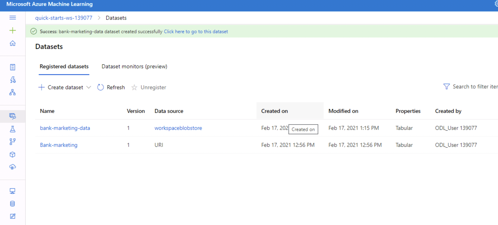
Next a new Auto ML run is created using the uploaded dataset and the following configurations:
- Task: *Classification
- Primary metric: *Accuracy
- *Explain best model
- Exit criterion: *1 hour in Job training time (hours)
- *Max concurrent iterations*: 5. Number of concurrent operations must always be less than the maximum number of nodes configured in the cluster.

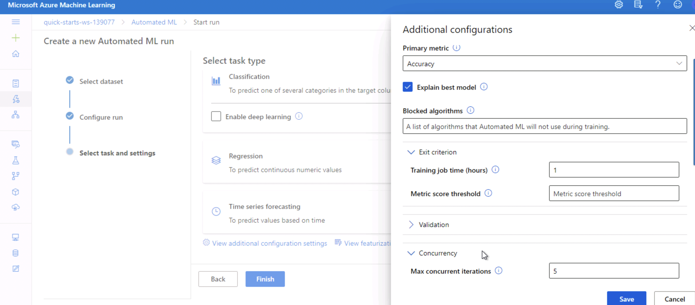
Experiment is completed:
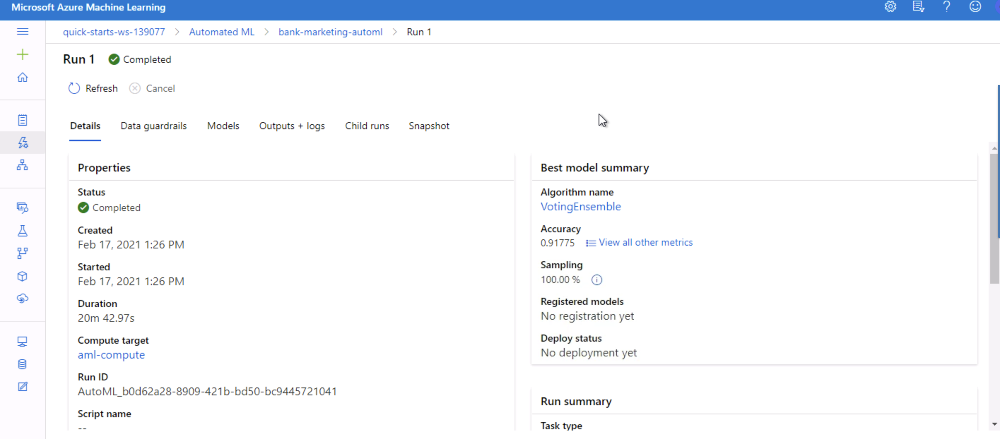
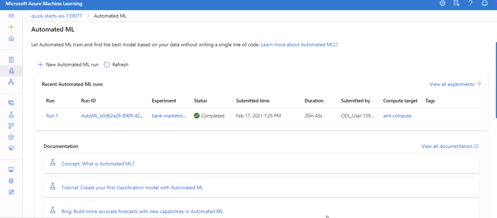
We can see the best model and details about it:
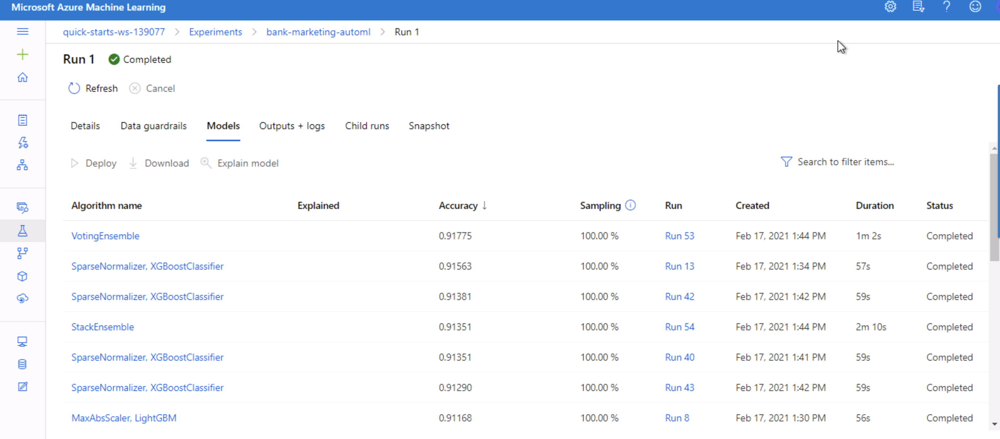
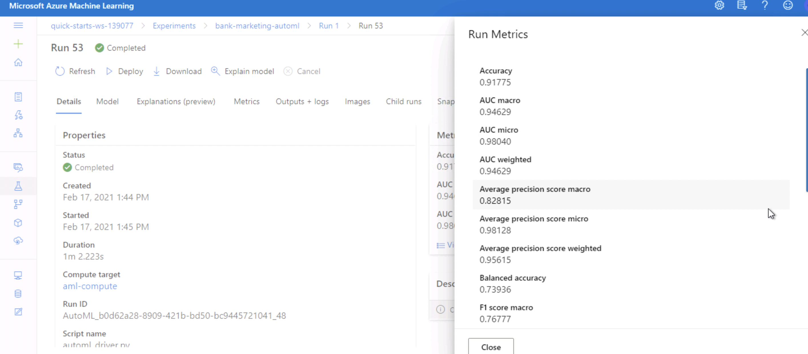
Interesting info about potential issues with the data can be seen by clicking the *Data guardrail* tab, for example that imbalanced data issue is flagged:
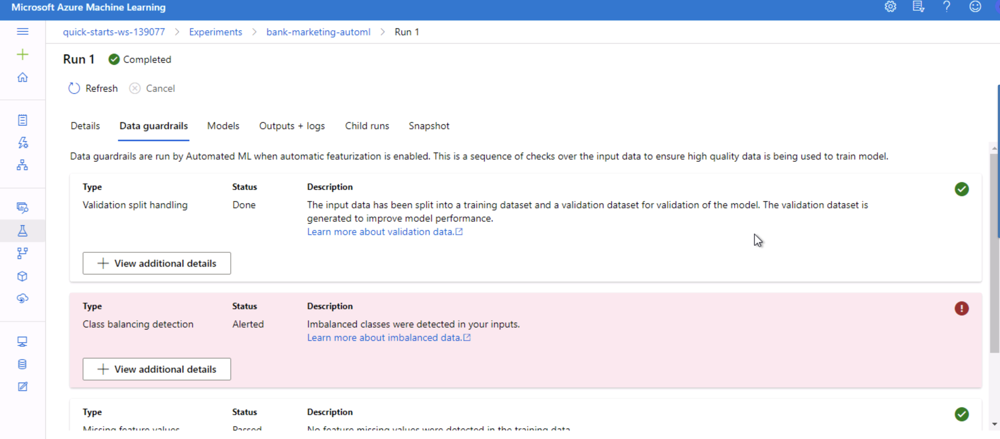

#### Step 3: Deploy the Best Model
Next the best model is deployed. First the best model is chosen by selecting the best performing model, in this case by *Accuracy*, from the *Models* tab. Then the model is deployed with *Authentication* enabled and using *Azure Container Instance (ACI)*. Deploying the Best Model will allow to interact with the HTTP API service and interact with the model by sending data over POST requests.

#### Step 4: Enable Application Insights
Now that the Best Model is deployed,  Application Insights is enabled to retrieve logs. You can see *Application Insights* enabled in the *Details* tab of the endpoint:
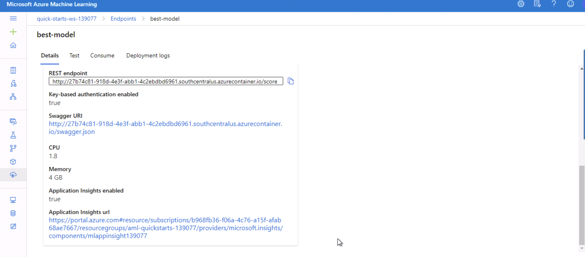
Application Insights running: 
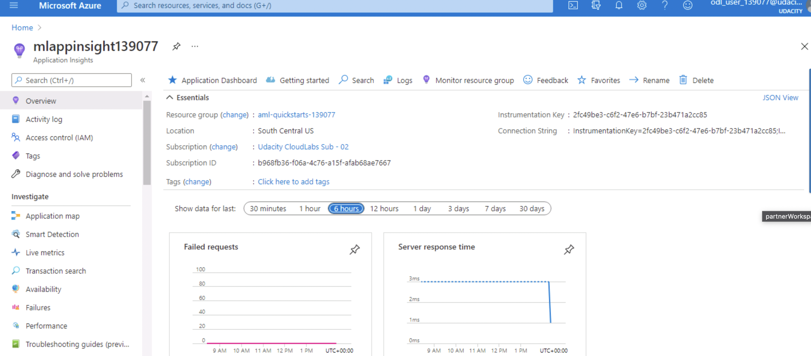
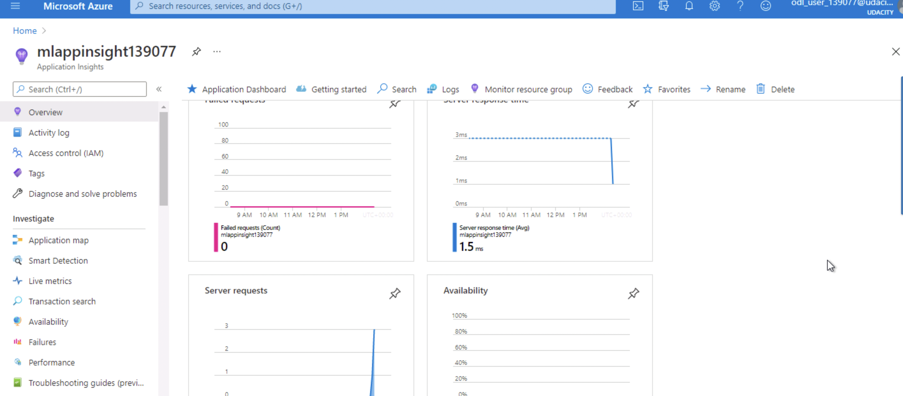
```logs.py``` script running:
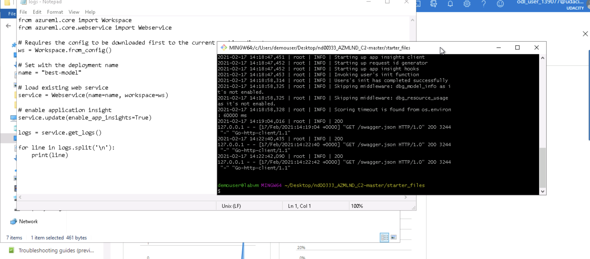

#### Step 5: Swagger Documentation
The [Swagger UI](https://swagger.io/tools/swagger-ui/download/) is an open source project to visually render documentation for an API defined with the OpenAPI (Swagger) Specification. Swagger UI lets you visualize and interact with the API’s resources without having any of the implementation logic in place, making it easy for back end implementation and client side consumption

In this step the deployed model is consumed using Swagger. Azure provides a Swagger JSON file for deployed models in the Endpoints section of the deployed model. This file is then downloaded and saved in the Swagger folder. Then swagger.sh and serve.py files are executed. The two files download and run the latest Swagger container (swagger.sh), and start a Python server.
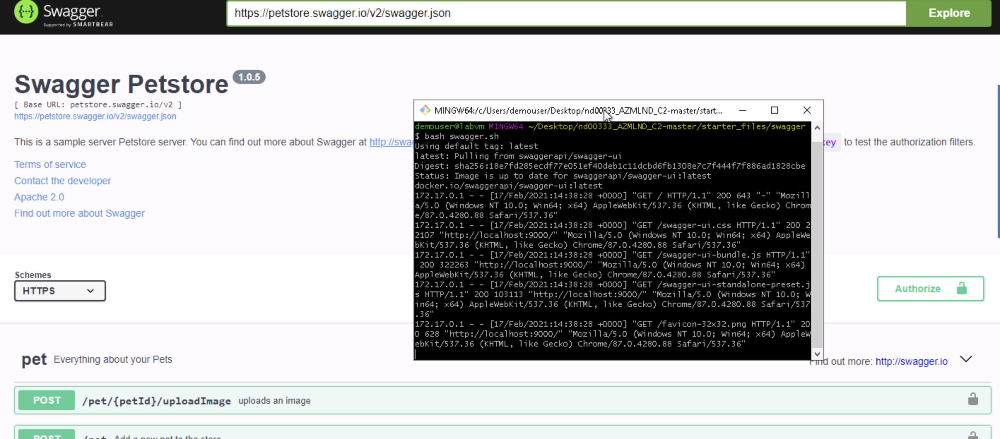
Below we can see the HTTP API methods and responses for the model:
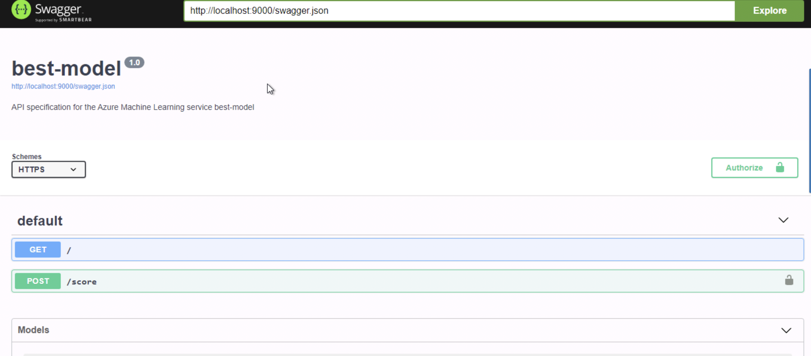
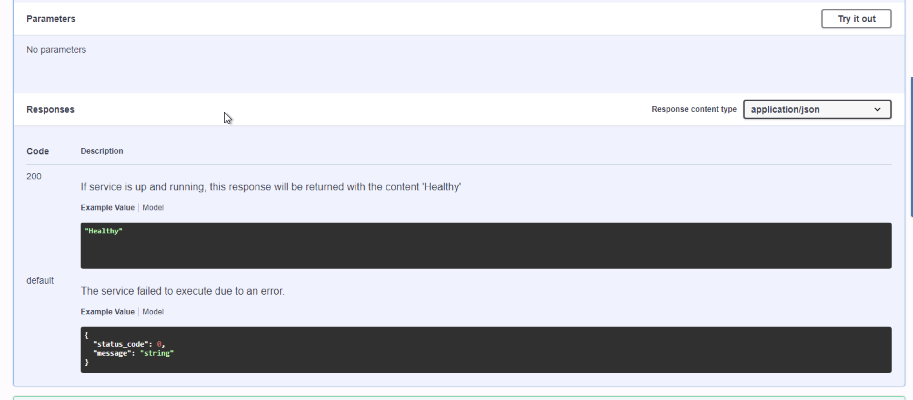
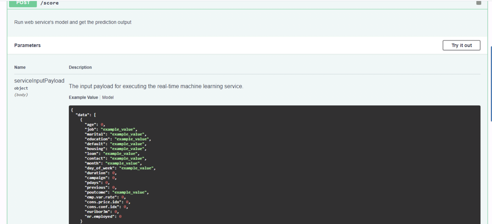

#### Step 6: Consume Model Endpoints
Once the model is deployed, ```endpoint.py``` script is used to interact with the trained model. The script is run after modifying both the scoring_uri and the key to match the key for Azure service and the URI that was generated after deployment.
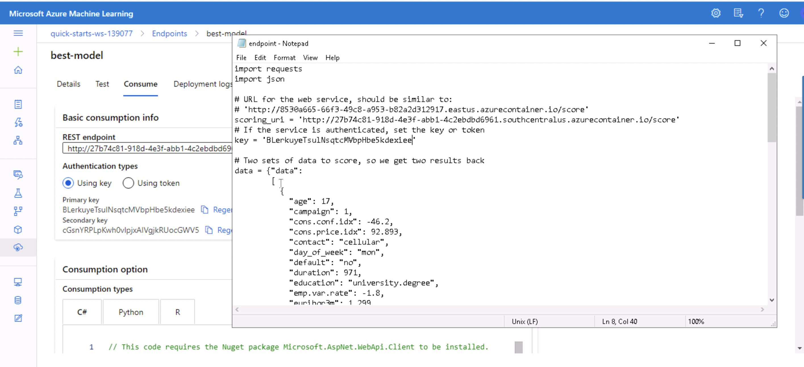
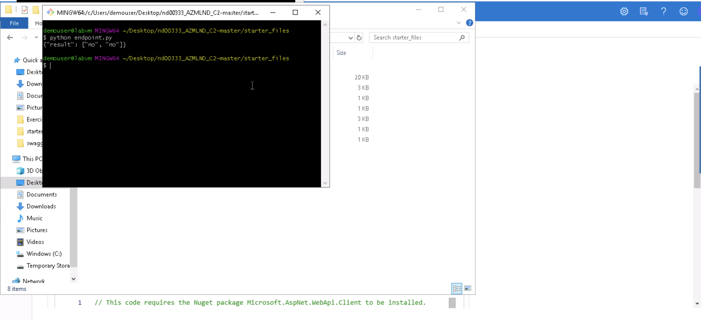

#### Step 7: Create, Publish and Consume a Pipeline
For this part of the project, the provided Jupyter Notebook: ```ml-pipelines-with-automated-machine-learning-step.ipynb``` is used. The notebook is updated to have the same keys, URI, dataset, cluster, and model names that have already been created.

The purpose of this step is to create, publish and consume a pipeline using the Azure Python SDK:
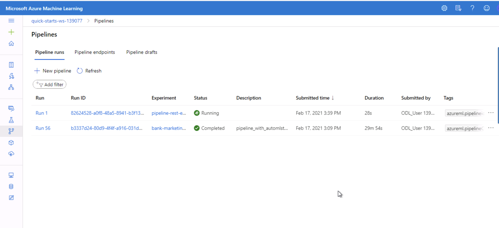
Bankmarketing dataset with the AutoML module:
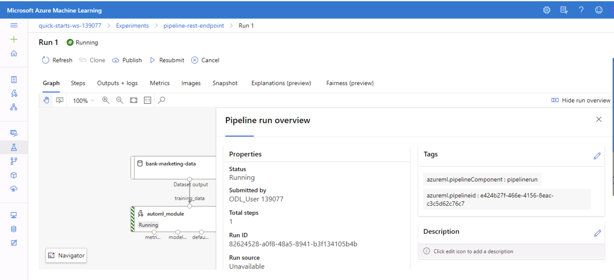
Published pipeline overview showing a REST endpoint and an ACTIVE status:
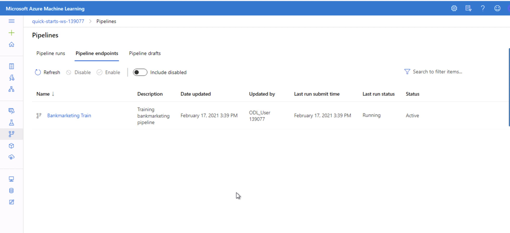
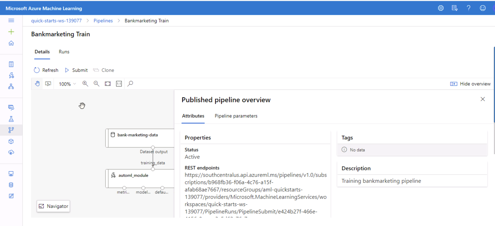
Jupyter Notebook showing that the RunDetails Widget shows the run steps:
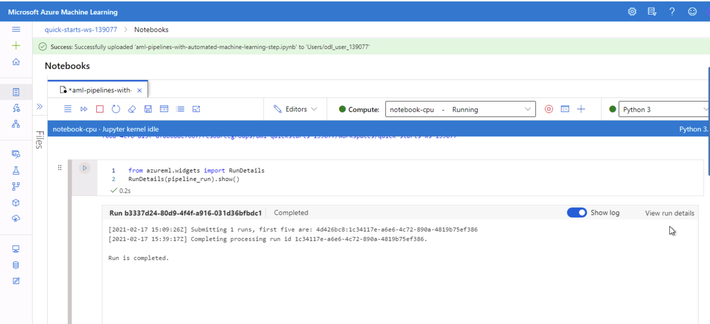
Azure ML Studio showing completed runs:
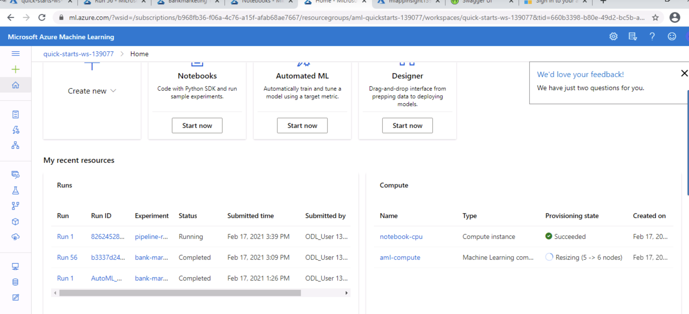


## Screen Recording
[Here](https://www.icloud.com/iclouddrive/0wQMFD1pP10Ece8n2Du459lWg#Udacity%5Fscreencast) is a link to the screencast which demonstrates:

- The working deployed ML model endpoint
- The deployed Pipeline
- Available AutoML Model
- Successful API requests to the endpoint with a JSON payload


TODO Provide a link to a screen recording of the project in action. Remember that the screencast should demonstrate:

Standout Suggestions

TODO (Optional): This is where you can provide information about any standout suggestions that you have attempted.
